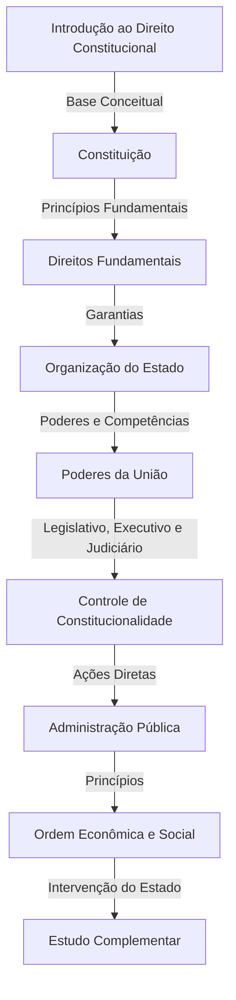

# Direito-Constitucional

# Roadmap de Direito Constitucional para Concursos

Este roadmap apresenta um guia estruturado para o estudo de Direito Constitucional para concursos públicos. Ele foi elaborado com base nos principais tópicos cobrados nos editais e segue uma abordagem lógica de aprendizado.

## 📌 Introdução ao Direito Constitucional
- Conceito e Finalidade do Direito Constitucional [(Link para estudo)](https://www.planalto.gov.br/ccivil_03/constituicao/constituicao.htm)
- Direito Constitucional e os demais ramos do Direito [(Material complementar)](https://www.jusbrasil.com.br)
- Constitucionalismo e sua evolução [(Artigo acadêmico)](https://www.conjur.com.br/2021-set-27/evolucao-constitucionalismo)
- Supremacia da Constituição [(Leitura recomendada)](https://www.direitonet.com.br/artigos/exibir/14219/A-supremacia-da-Constituicao)

## 🏛️ Constituição
- Conceito e Elementos da Constituição [(Resumo)](https://www.direitonet.com.br/resumos/exibir/2844/Elementos-da-Constituicao)
- Classificação das Constituições [(Material didático)](https://www.jusbrasil.com.br/doutrina/classificacao-das-constituicoes)
- Princípios Fundamentais [(Leitura complementar)](https://www.planalto.gov.br/ccivil_03/constituicao/constituicao.htm#tituloi)
- Poder Constituinte Originário e Derivado [(Explicação)](https://www.jusbrasil.com.br/doutrina/poder-constituinte)
- Emendas Constitucionais e Limites [(Análise prática)](https://www.stf.jus.br)

## 🏛️ Direitos e Garantias Fundamentais
- Direitos e Deveres Individuais e Coletivos (Art. 5º) [(Texto constitucional)](https://www.planalto.gov.br/ccivil_03/constituicao/constituicao.htm#art5)
- Direitos Sociais [(Leitura obrigatória)](https://www.jusbrasil.com.br/doutrina/direitos-sociais)
- Nacionalidade e Cidadania [(Estudo aprofundado)](https://www.direitonet.com.br/resumos/exibir/1997/Nacionalidade)
- Direitos Políticos e Partidos Políticos [(Resumo jurídico)](https://www.planalto.gov.br/ccivil_03/constituicao/constituicao.htm#tituloiii)

## ⚖️ Organização do Estado
- Princípios da Organização do Estado Brasileiro [(Material didático)](https://www.senado.leg.br)
- União, Estados, Municípios e Distrito Federal [(Resumo detalhado)](https://www.planalto.gov.br/ccivil_03/constituicao/constituicao.htm#tituloiii)
- Repartição de Competências [(Explicação prática)](https://www.jusbrasil.com.br/doutrina/reparticao-de-competencias)
- Intervenção Federal e Estadual [(Análise jurídica)](https://www.stf.jus.br)

## 🏛️ Poderes da União
- Poder Legislativo [(Estrutura e Funcionamento)](https://www.camara.leg.br)
- Processo Legislativo [(Material oficial)](https://www.senado.leg.br)
- Fiscalização e Controle [(Aprofundamento)](https://www.tcu.gov.br)
- Poder Executivo [(Atribuições do Presidente da República)](https://www.planalto.gov.br)
- Responsabilidade do Presidente [(Estudo de caso)](https://www.stf.jus.br)
- Poder Judiciário [(Estrutura e Organização)](https://www.cnj.jus.br)
- Competências [(Leitura recomendada)](https://www.stf.jus.br)
- Garantias dos Magistrados [(Explicação detalhada)](https://www.direitonet.com.br/resumos/exibir/2192/Garantias-dos-magistrados)

## 🏛️ Controle de Constitucionalidade
- Conceito e Finalidade [(Resumo prático)](https://www.jusbrasil.com.br/doutrina/controle-de-constitucionalidade)
- Tipos de Controle (Preventivo, Repressivo, Difuso, Concentrado) [(Explicação jurídica)](https://www.stf.jus.br)
- Ações de Controle de Constitucionalidade (ADI, ADC, ADPF, ADO) [(Estudo aprofundado)](https://www.planalto.gov.br)
- Efeitos das Decisões [(Análise prática)](https://www.jusbrasil.com.br/doutrina/efeitos-das-decisoes-constitucionais)

## ⚖️ Administração Pública
- Princípios da Administração Pública [(Material essencial)](https://www.planalto.gov.br/ccivil_03/constituicao/constituicao.htm#art37)
- Servidores Públicos [(Legislação aplicada)](https://www.planalto.gov.br/ccivil_03/leis/l8112compilado.htm)
- Responsabilidade Civil do Estado [(Explicação detalhada)](https://www.jusbrasil.com.br/doutrina/responsabilidade-civil-do-estado)

## 📜 Ordem Econômica e Social
- Princípios Gerais da Ordem Econômica [(Texto constitucional)](https://www.planalto.gov.br/ccivil_03/constituicao/constituicao.htm#titulovii)
- Função Social da Propriedade [(Explicação jurídica)](https://www.jusbrasil.com.br/doutrina/funcao-social-da-propriedade)
- Ordem Social e Direitos Fundamentais [(Material didático)](https://www.senado.leg.br)

## 📚 Estudo Complementar
- Resolução de Questões [(Banco de questões)](https://www.qconcursos.com)
- Leitura de Doutrinas [(Sugestão de leitura)](https://www.livrariart.com.br)
- Análise de Jurisprudências [(Decisões atualizadas)](https://www.stf.jus.br)
- Simulados e Revisões [(Material de apoio)](https://www.estrategiaconcursos.com.br)

---

Este roadmap serve como um guia de estudo, podendo ser adaptado conforme o edital específico de cada concurso.
